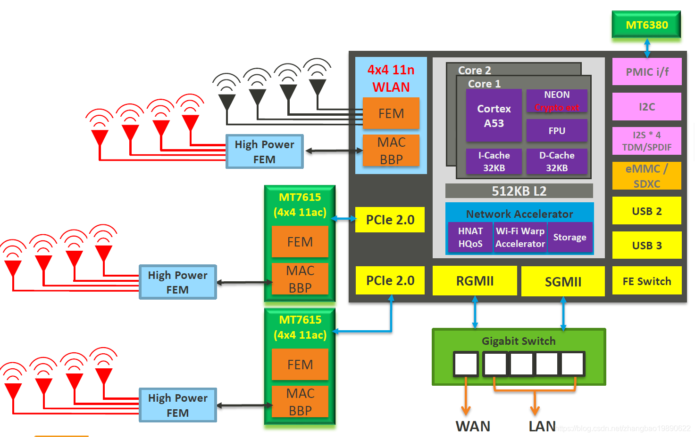

# [MT7622](https://github.com/SoCXin/MT7622)

* [MediaTek](https://www.mediatek.com/): [Cortex-A53](https://github.com/SoCXin/MIPS)
* [L7R7](https://github.com/SoCXin/Level):  

## [简介](https://github.com/SoCXin/MT7622/wiki)

[MT7622](https://github.com/SoCXin/MT7622) 是全球首款采用4x4n 802.11n /蓝牙5.0系统芯片的系统，专为高性能网络设备而设计，适用于多种应用，包括路由器/中继器，家庭自动化网关，无线音频和无线存储。高度通用的芯片组为流行的4X4双频和三频道路由器/中继器提供了一个单一平台，为寻求构建顶级网络设备的制造商提供了最大的灵活性。该平台通过成本效益高的方法将高性能和广泛集成的功能相结合。

MT7622包含联发科的自适应网络技术，允许轻松设置，网络自愈，漫游，频带转向，智能服务质量，高级安全性等。对于音频和语音控制应用，包括基本音频接口，如I2S，TDM和S / PDIF。对于家庭自动化网关，除了集成的Wi-Fi，蓝牙和Zigbee共存之外，还有一系列缓慢的I / O。

MT7622采用了时钟频率为1.35GHz的64位双核ARM Cortex-A53处理器，提供了诸如SGMII / RGMII，PCIe和USB以及4X4 802.11n FEM集成的高级连接选项。使用802.11ac扩展平台以满足额外的市场需求通过MT7615 SoC完成。

MT7622引入了一流的功能，如蓝牙5.0和专用的网络加速引擎与联发科Wi-Fi扭曲加速，存储加速（SATA 3.0 / eSATA Gen2）和HNAT HQoS计算从CPU卸载，降低整体电力使用和释放资源，以避免任何潜在的减速。

联发科Wi-Fi扭曲加速的优势是双重的。首先，它将Gigabit + class 802.11ac网络连接到千兆交换机/ WAN连接，通过千兆位内部路径，确保没有瓶颈。其次，其专门的设计不仅可以从多用户吞吐量和QoS计算中卸载CPU，而且功耗较低。结果是联发科Wi-Fi Warp加速功能在甚至支持多个同时繁忙的用户时保持持续的高性能。

集成蓝牙允许通过应用程序进行直接的本地无线连接，便于路由器/ Wi-Fi设置的配置。最新的蓝牙5.0倍增倍，与之前的4.x技术相比，速度提高了一倍，可以实现新的创新。

### 关键特性

* MediaTek MT7622,1.35GHZ 64 bit dual-core ARM Cortex-A53
* 1G DDR3 SDRAM
* Mini PCIE interface support 4G module
* built-in 4x4n 802.11n/Bluetooth 5.0 system-on-chip

### [资源收录](https://github.com/SoCXin)

* [参考资源](src/)
* [参考文档](docs/)
* [参考工程](project/)

### [选型建议](https://github.com/SoCXin)

[BPI-R64](https://wiki.banana-pi.org/%E9%A6%99%E8%95%89%E6%B4%BE_BPI-R64)

### [www.SoC.xin](http://www.SoC.Xin)
